# UAT — Strategy → company search

A user-acceptance pass over the Strategy screen and the company search behind it, driven through the
real SPA in headless Chromium against a real API and a real Postgres, plus direct probes of the HTTP
contract. Nothing in the application was changed to run it.

**Verdict: the feature holds up.** Every filter axis, the facet arithmetic, the LIKE escaping, the
sorting, the paging, the off-limits list, the saved searches, the triage hand-off, tenant isolation
and seat gating all behave as their own documentation claims. Four things are wrong, one of them
silently: a saved search can capture the wrong filter, a company whose headcount is `0` cannot be
reached through the Employees panel at all, and the off-limits picker hides the list it is adding to.

The scenarios are committed as repeatable scripts — `e2e/api/14-strategy-company-search.sh` and
`e2e/spa/strategy.mjs` — so this pass can be re-run, and should be re-run against the real universe.

---

## 1. The data caveat, read this first

The real Apollo universe lives in Cloud SQL and needs `gcloud` to pull down. The container this ran
in has no `gcloud` and no network path to that instance, so **the 71,822 rows used here are a stand-in
generated to match the shape the code documents**:

| Property | Real universe (per the code's own comments) | Stand-in used here |
|---|---|---|
| Rows | 71,822 | 71,822 |
| `annual_revenue` populated | 7,132 (9.9%) | 7,132 (9.9%) |
| `annual_revenue` null | 64,690 | 64,690 |
| `num_employees` populated | 100% | 100% |
| Distinct industries | 148, from `sector-taxonomy.json` | the same 148, read from that file |
| Distinct countries | 6 GCC | 6 GCC |
| `keywords` | free-text array | drawn from `market-segments.json` |

Company names, cities and descriptions are invented. The rows were loaded only into a local database.

Everything below that compares a screen against a number was checked against that database with SQL,
so the **logic is genuinely verified**. What a stand-in cannot verify is the **content** of the real
table — which is exactly where finding F2 lands, and why it needs one query run against production
before it can be closed either way.

## 2. Coverage

| Area | Cases | Result |
|---|---|---|
| Login, session restore, route guard | 4 | pass |
| Facet counts vs `SELECT count(*)` | 8 | pass |
| Filtering — every axis, OR within, AND across | 13 | pass |
| Name search, `%` / `_` escaping, empty states | 5 | pass |
| Sorting — every column, both directions, NULLS LAST | 6 | pass |
| Pagination and page-reset behaviour | 6 | pass |
| Off-limits — bar, exclude, un-bar | 7 | 1 fail (**F8**) |
| Saved searches — save, load, rename, delete, limits | 10 | 1 fail (**F1**) |
| Triage — add, bulk add, refusal, stage moves | 13 | pass |
| Column picker and its persistence | 2 | pass |
| HTTP contract — validation, limits, error codes | 64 | pass |
| Tenant isolation and seat gating | 9 | pass |

---

## 3. Findings

### F1 — A saved search can capture the filter as it was *before* your last click · **high**

Clicking a filter chip and then saving a search within the next 700 ms stores the **pre-edit**
filter. The search is written silently and looks correct in the menu; it is the scope that is wrong,
and it stays wrong every time it is loaded afterwards.

Measured: a chip click followed by Save **351 ms** later stored `countries: []` where the screen —
and the chip the user had just clicked — said `Qatar`.

```
NOTE I5a   chip click -> Save took 351ms (autosave debounce is 700ms)
FAIL I5    a search saved that fast still captures the chip
           -> expected [["Qatar"]] got [[]]
NOTE I5b   what was actually stored: countries=[]
```

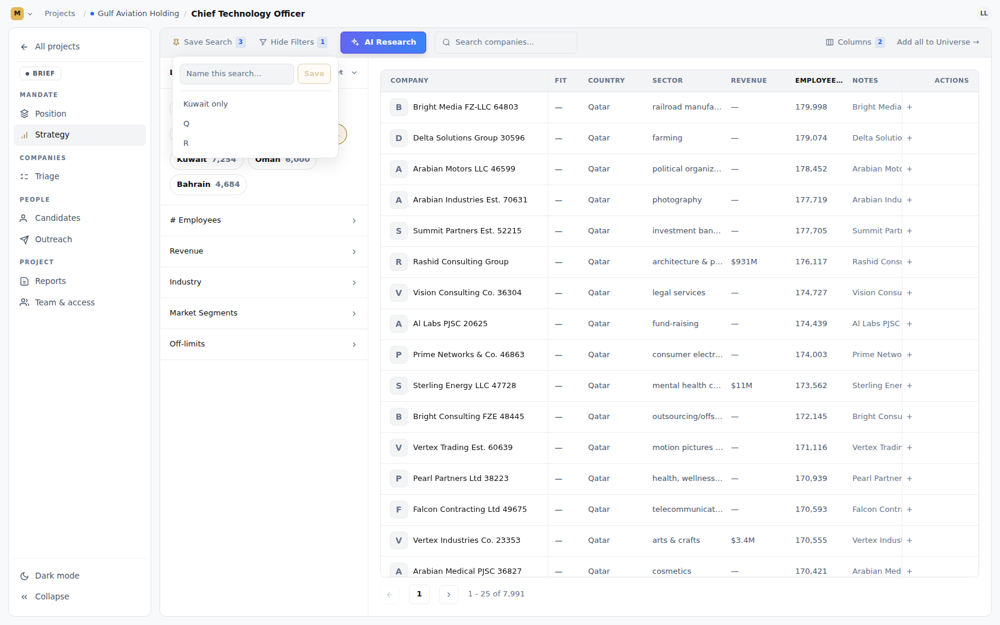

**Why.** The filter autosaves on a 700 ms debounce (`useAutosave`, `delayMs = 700`), and
`StrategySearchService.save` deliberately reads the *stored* filter rather than a payload from the
client — which is the right design. But `StrategyPage`'s save handler does not flush the pending
autosave first:

```ts
onSaveSearch={(name) => saveSearch.mutate(name)}
```

The same screen already knows this is necessary. `addAll` flushes for exactly this reason, and says
so:

```ts
mutationFn: async () => {
  // Flush first: "Add all" acts on the *stored* filter, and a debounced edit still in the
  // timer would mean the server adds companies from the filter as it was two chips ago.
  await autosave.flush();
  return triageApi.addAllInScope(project.id);
},
```

**Reproduce.** Reset the filter, click a Location chip, then immediately open Save Search, type one
character and hit Save. Read the stored search back from `GET /projects/{id}/strategy`.

**Shape of the fix** (not applied): `await autosave.flush()` in the save-search mutation — the same
one line `addAll` already has.

---

### F2 — A company with `num_employees = 0` belongs to no headcount band · **high, data-dependent**

Such a company is invisible in the **# Employees** facet and **unreachable by any band selection** —
ticking all eleven bands still misses it. Only a Custom Range starting at 0 finds it.

Probe: six rows were inserted into the local universe (three with headcount `0`, three with revenue
`0`), measured, then removed again.

```
universe now      : 71,828
employee band sum : 71,825      <-- three companies counted in no band
revenue band sum  : 71,828
country sum       : 71,828
sector group sum  : 71,828

every headcount band ticked -> 71,825 of 71,828
custom range 0–0            -> 3     ("Zero Headcount Co 1" …)
```

**Why it matters even if the live data has no zeros.** The codebase asserts both that they exist and
that they do not:

- `EmployeeBand`: *"Every row in `app_lm_apollo_companies` carries a headcount — the column is 100%
  populated across all 71,822 rows — so unlike `RevenueBand` this axis needs no Unknown band."*
- `CompanySortField`: *"`NULLIF` guards the columns where Apollo encodes 'we don't know' as a zero.
  Only the null form sinks under `NULLS LAST` on its own…"* — and it wraps `num_employees` in exactly
  that guard.

The sort layer is written for zeros; the band layer is written as though there are none. One of the
two is wrong about the live table, and guessing wrong means a silent under-count on the axis
consultants filter on most.

**Settle it with one query against the real database:**

```sql
SELECT count(*) FILTER (WHERE num_employees IS NULL)  AS null_headcount,
       count(*) FILTER (WHERE num_employees = 0)      AS zero_headcount,
       count(*) FILTER (WHERE annual_revenue = 0)     AS zero_revenue
FROM app_lm_apollo_companies;
```

If either headcount column is non-zero, the Employees panel is under-reporting and those companies
cannot be reached; the same Unknown treatment `RevenueBand` already has would fix it. If all three are
zero, `CompanySortField`'s `NULLIF` guards are dead weight and its comment is misleading — worth
correcting either way.

---

### F3 — `annual_revenue = 0` is reported as "< $1M", not as Unknown · **medium, data-dependent**

Same root cause as F2, opposite failure. `RevenueBand.R_UNDER_1M` has a lower bound of `0`, so a row
carrying `0` counts as a real sub-$1M company in both the facet and the filter — while
`CompanySortField` treats that same `0` as "we don't know" and buries it under `NULLS LAST`. The
Unknown band only ever means `annual_revenue IS NULL`.

Confirmed in the probe above: with three zero-revenue rows present, `under-1m` counted them and
`unknown` did not. Whether it bites depends on the same query as F2.

---

### F4 — The "Show Filters" badge ignores a Custom Range · **low**

With a custom headcount range as the only thing filtering, the badge beside *Hide Filters* reads
**0** — the toolbar says nothing is filtering while 71,822 rows have been narrowed to a handful. The
accordion's own tag does show the range, so the two disagree on the same screen.

```
NOTE D5b   the "Show Filters" active-axis badge reads "0" while a custom range is the only filter in force
```

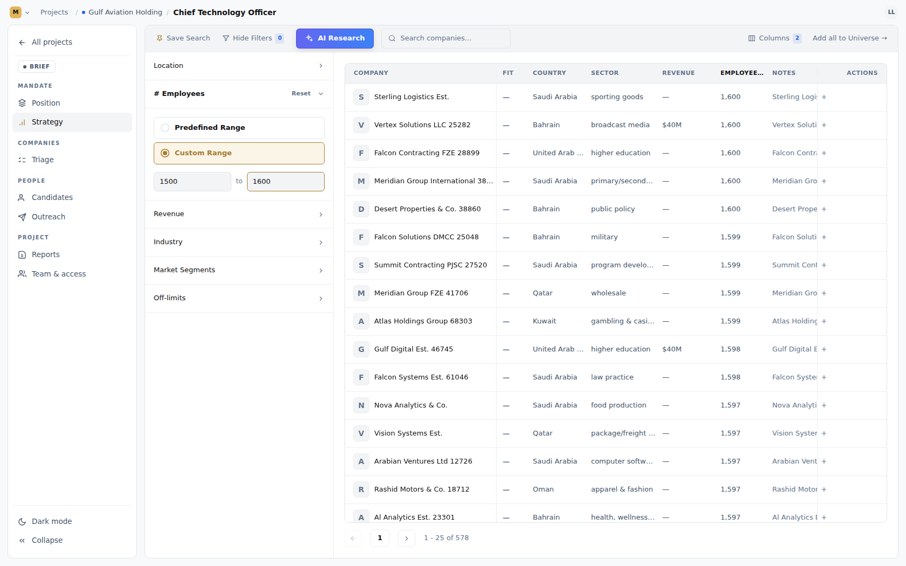

`activeAxisCount` in `StrategyToolbar` counts the five array axes and neither `employeeRange` nor
`revenueRange`.

---

### F5 — A ~1 s window where the chips and the table disagree, with no loading signal · **low**

```
NOTE M2   chip click -> table caught up in 987ms (700ms of that is the autosave debounce,
          during which the chip reads selected while the table still shows the old 71,822)
```

The chip paints as selected immediately; the results only change once the debounced PUT lands and the
scoped reads are invalidated. During the 700 ms debounce **no request is in flight**, so
`companies.isFetching` is false and the table shows neither a spinner nor a dimmed state — it shows
the previous answer as though it were current. A user who clicks a chip and reads the count straight
away reads the wrong number.

---

### F6 — The count bar reads "0 results" while the first page is loading · **low**

```
NOTE M1   the pagination bar reads "0 results" while the first page is still loading
```

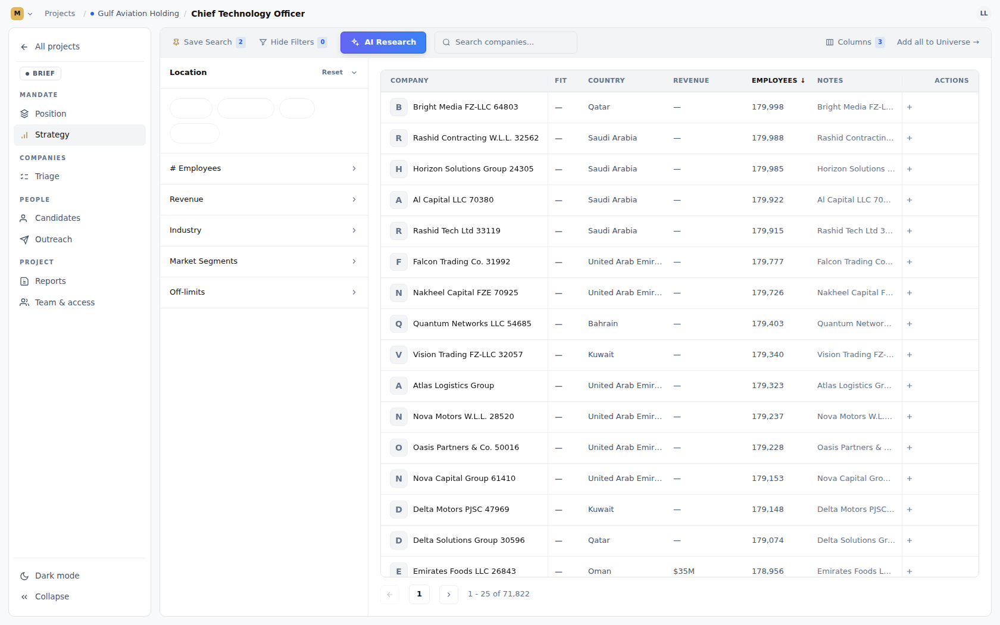

`PaginationBar` receives `companies.data?.totalCount ?? 0`, and `totalCount === 0` renders the literal
string `0 results`. The table beside it correctly shows a skeleton, so for a moment the screen says
both "loading" and "nothing matched".

---

### F7 — Cosmetic: truncation, and one overlap · **low**

At a 1680 px viewport (an ordinary laptop):

- **Country** clips to `United Arab …` — and that value is 34% of the universe, so the most common
  cell in the table is the one you cannot read. Its column floor is 96 px.
- The **Employees** header renders as `EMPLOYEE…`.
- Many **Sector** labels clip (`computer netwo…`, `computer & net…`); that vocabulary is long by
  nature.
- The toast sits bottom-centre at `z-120` and **covers the pagination controls** while it is up.

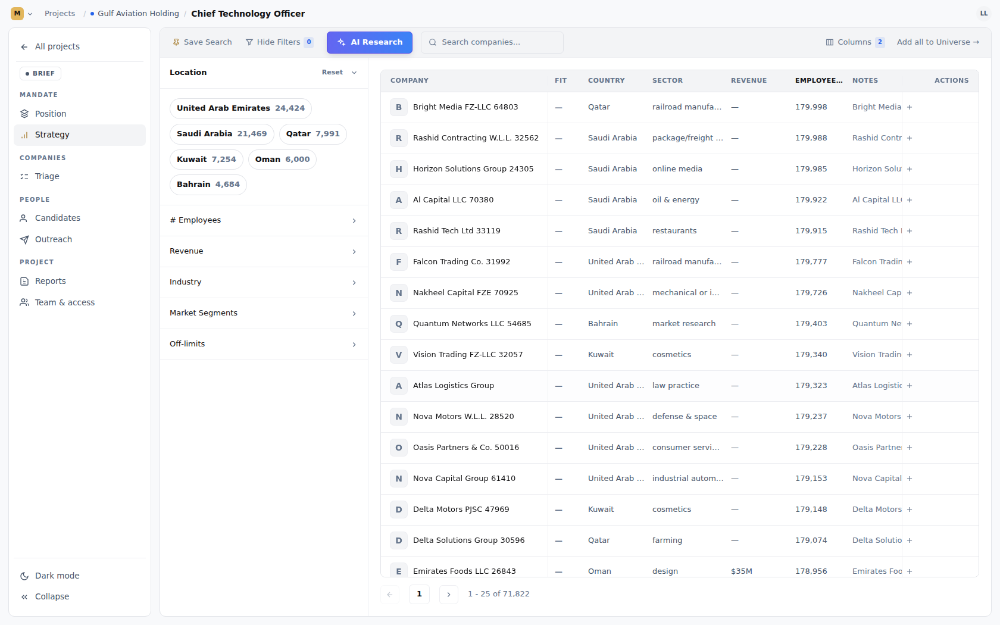
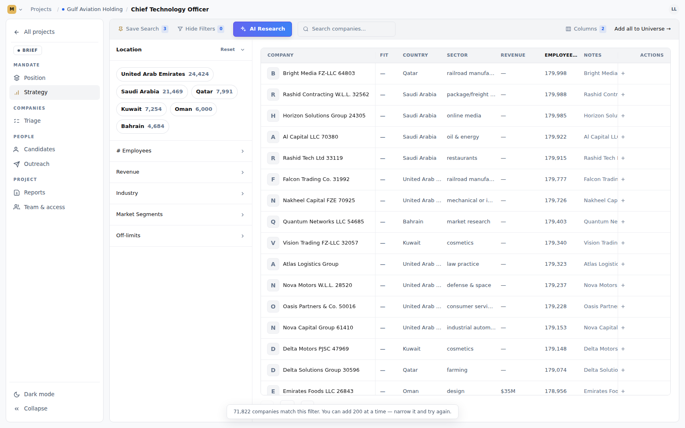

---

### F8 — The off-limits picker's dropdown stays open over the chips it just added to · **medium**

Pick a company from the Off-limits search and the suggestion list **stays open, showing the previous
results**, covering the `EXCLUDED (n)` list directly beneath it. The company you just barred is
already there and already applied — you simply cannot see it, or click its remove button, until you
click somewhere else to dismiss the list.

Found the honest way: an automated click on the new chip could not land, because the dropdown was on
top of it.

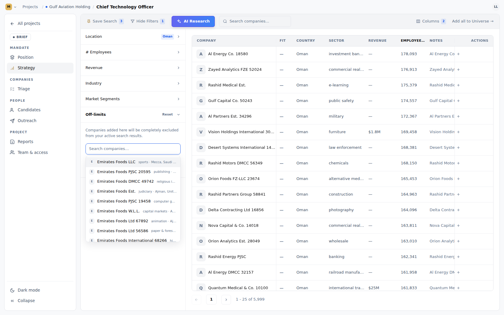

`CompanySearchCombobox.pick()` clears the text but never closes the list:

```ts
const pick = (company: CompanySuggestion) => {
  onPick(company);
  setDraft("");
  setSettled("");
  setActive(0);
};                       // `open` is left true
```

and `placeholderData: keepPreviousData` keeps the previous rows in `data` while the new (empty,
disabled) query has none of its own — so `showList = open && matches.length > 0` stays true with a
blank input. A `setOpen(false)` in `pick` closes it. The same picker backs the client registry, so
this shows up in both places.

---

### F9 — Smaller notes

| # | Observation |
|---|---|
| a | The off-limits picker filters already-barred ids **client-side, after** the server's ten suggestions. Bar the ten biggest matches for a name and the box reports "no matches" though more exist. |
| b | Adding a company the mandate already holds returns **201 Created** for a row it did not create. The service is correctly idempotent — it returns the existing row — but the status code says otherwise. |
| c | `PATCH /searches/{id}` (rename) works and is covered by tests, but **no UI reaches it** — `SaveSearchMenu` offers load and delete only. |
| d | `application.yml` says of the search limit *"a larger requested limit clamps to this"*; `CompanySearchController` refuses it with a 400 instead, and its own comment says refused. The yml comment is stale. |

---

### F10 — 861 companies carry no industry, so the Sector axis alone cannot reach them · **medium**

Found only when these scripts were re-run against the **real** universe, which is what §1 said was
still needed. The stand-in populated `industry` for every row, so this pass could not have seen it.

`industry IS NULL` for 861 of 71,822 rows (0 are blank strings; all 148 industries are themselves
covered by the taxonomy). `lower(industry) IN (:industries)` cannot match NULL, so:

- the Sector accordion's counts sum to **70,961**, not 71,822 — the rail disagrees with the table
  beside it on an untouched filter; and
- **ticking all 20 sector groups returns the same 70,961 as ticking one.** There is no way to say
  "any industry, including the ones we don't know" — the escape hatch `RevenueBand.R_UNKNOWN` gives
  the revenue axis.

**Scope, precisely:** those companies are *not* missing from the product. With no sector selected
they appear normally and combine with every other filter — 296 of them under `country = UAE`, 76
under headcount 51–100, 815 under revenue Unknown. Only the Sector axis excludes them.

Tracked as **issue #91**. Cases `14.4` and `S2.4` print the sum as a NOTE rather than asserting it,
so a known gap on one axis does not turn the whole matrix red.

---

## 4. What was verified as correct

Worth recording, because most of this is the part that is easy to get wrong.

**Facet counts** — all five accordions reconcile exactly with `SELECT count(*)`. The employee bands
sum to the whole universe, the revenue bands sum to the whole universe *including* Unknown at 64,690,
the 20 sector groups cover all 148 industries with none dropped (though not every *company* — see
F10), and the market segments overlap by
design — they sum to 140,002 over 71,822 rows, which is the honest answer for an axis where a company
can hold several positions.

**Filtering** — chips on one axis OR (`Qatar` + `Bahrain` = 12,675 = the SQL union); different axes
AND (`computer software` × `Saudi Arabia` = 152 = the SQL intersection); a Custom Range wins outright
over ticked bands, and switching back to Predefined clears it; `Revenue → Unknown` reaches all 64,690
rows carrying no figure; a whole sector takes all eleven of its industries, and with *Include
Sub-Industries* unticked, opening a sector selects nothing.

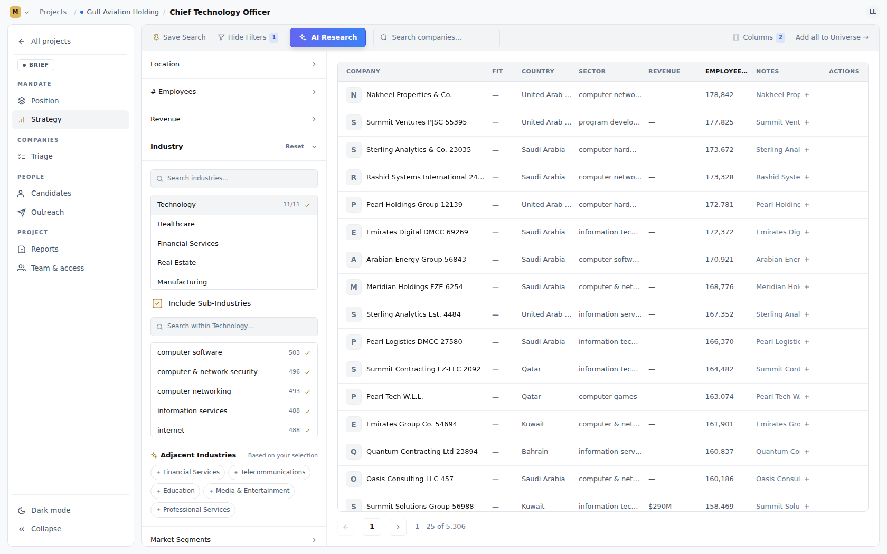
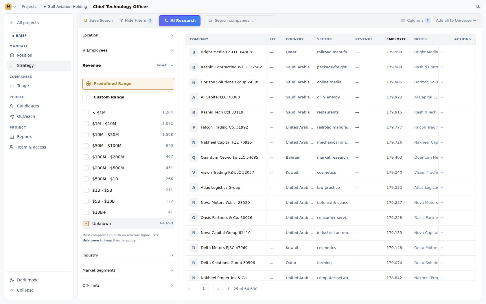

**Escaping** — `%` and `_` are matched as literal characters in both the table's name box and the
typeahead. A search for `%` returns the companies whose names contain a percent sign, not everything.

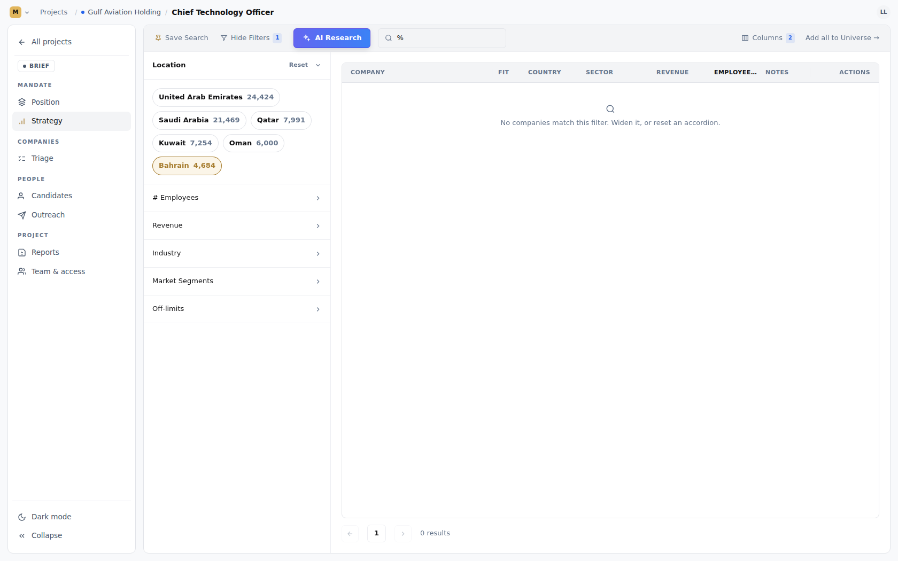

**Sorting** — every column sorts server-side through the allowlist; an ascending Revenue sort opens on
`$51,757`, not on the nine-in-ten blank rows, so `NULLS LAST` is doing its job in both directions;
changing the sort returns to page 1. (An earlier "failure" here was the harness's own selector hitting
the sidebar's *Revenue* accordion instead of the column header — the sort itself is correct.)

**Pagination** — page 2 reads `26 - 50 of 4,684`, Previous is disabled on page 1, and adding a filter
while on page 4 returns to page 1 rather than showing an empty table over a non-empty result.

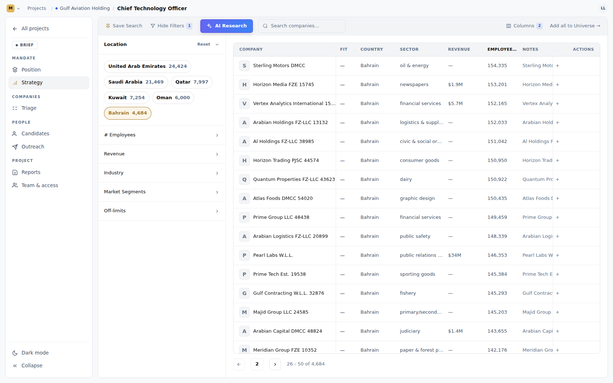

**Off-limits** — barring two companies drops the count by exactly two, they never appear in any page,
and un-barring restores them one at a time — the exclusion logic itself is exactly right, F8 is only
about seeing it. The snapshot is resolved server-side: an id the universe does not hold is refused,
and a duplicate is refused rather than silently collapsed.

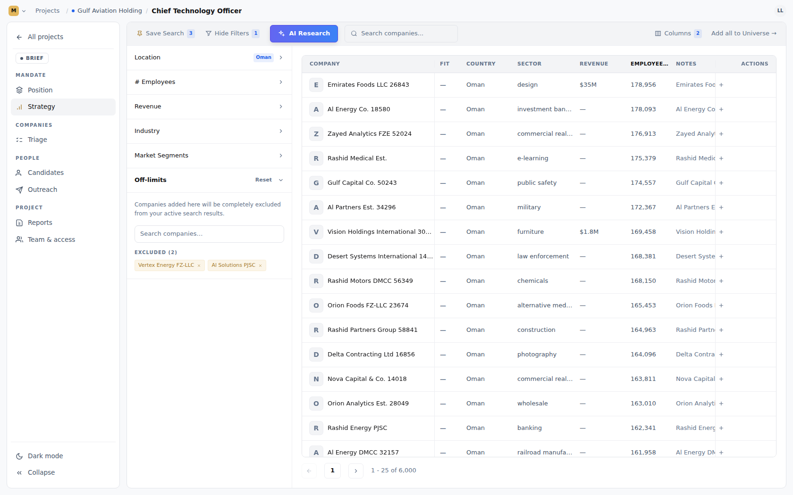

**Triage hand-off** — the row `+` files exactly one company and a second click does not double-file it;
*Add all to Universe* over an untouched filter is refused **whole**, and the server's own sentence
reaches the user with both numbers intact ("71,822 companies match this filter. You can add 200 at a
time — narrow it and try again."); re-running it adds nothing new; a company moved to Declined keeps
its note when moved on again. The Triage screen's stage counts match the database.

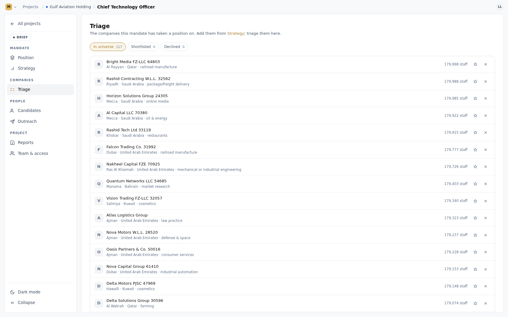

**Column picker** — hiding a column removes it, and it stays hidden across a reload, per project.

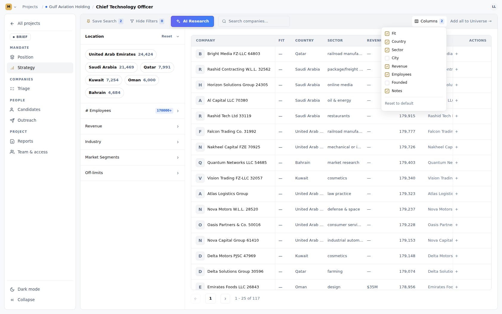

**Tenant isolation and seat gating** — 9 of 9. Another workspace's admin gets 404 on the mandate's
strategy, its company list, its triage, and on writing its filter. A member of *this* workspace with
no seat on the project gets 403 on the mandate's content but 200 on the universe's facets and
typeahead — exactly the line the controllers describe: the market's shape is a workspace-level read,
a mandate's scope is project content.

**HTTP contract** — 64 of 64. Limits refused rather than clamped (`limit=26` → 400, `size=101` → 400,
`page=-1` → 400); unknown sort field, direction and stage all 400; a column outside the sort allowlist
(`notes`) 400; a page past the end is an empty page, not an error; an inverted custom range
(`min 5000 / max 500`) is refused rather than swapped; a negative bound is refused; an industry the
universe no longer carries is *accepted* and narrows to nothing, while an unknown band slug is refused
— the distinction the code documents; a custom range saves and reads back intact, so the regression
V30 fixed has not returned; duplicate saved-search names 409; blank and 121-character names 400;
deleting a search twice 404s rather than 500s.

---

## 5. How this was run

No application code, configuration or migration in the repository was modified.

- **Postgres** — Docker Hub is blocked by this environment's egress policy, so `npm run dev:db` could
  not pull `postgres:16-alpine`. A native PostgreSQL 16 cluster was started on the same port (55433)
  with the same credentials `ops/dev/api.sh` expects, so the API booted unmodified and Flyway applied
  all 31 migrations to v32.
- **API / SPA** — `ops/dev/api.sh` and `npm run dev:web`, unchanged. `application-local.yml` was
  created from the committed `.example` — it is gitignored, so this is not a repository change — with
  `cookie.secure: false` for plain-HTTP localhost and the email provider set to `log`.
- **Universe** — the stand-in described in §1, loaded straight into `app_lm_apollo_companies`.
- **Driver** — Playwright over the pre-installed Chromium driving the real SPA; `curl` for the HTTP
  contract; `psql` for every expected value. Screenshots are unretouched.

### Re-running it

```bash
npm run dev                                   # api + web + local postgres
npm run dev:db:apollo                         # the REAL universe (needs gcloud) — do this first
bash e2e/api/14-strategy-company-search.sh    # the HTTP contract, RBAC, triage
node e2e/spa/strategy.mjs                     # the screen, with screenshots
```

Both scripts read the universe as they find it: they take their expected values from `psql` rather
than hard-coding counts, so they are correct against the real 71,822 rows and against any later
pipeline load. Running them against the real universe is what turns F2 and F3 from "data-dependent"
into a yes or a no.
